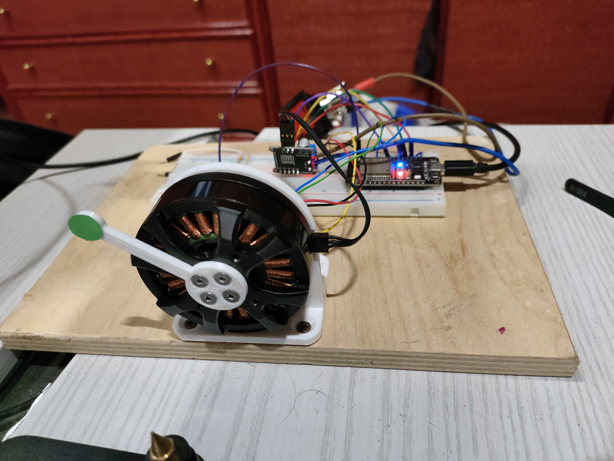

# Visual Servoing

## Goal
The goal of this project is to control the position of a motor using a camera.

In particular, the target position will be set with a click of the mouse.

## Hardware
- ESP32 devkit V1 
- GBM5208-75T brushless motor
- SimpleFOC shield mini
- AS5600 magnetic encoder
- 15V power supply
- a computer running the computer vision program

## Software

### Microcontroller
The microcontroller runs a simple velocity control program. The control loop is almost entirely handled with the SimpleFOC library, that allows for a simple and effective integration of the BLDC driver, the magnetic sensor, and the PID controller.

The microcontroller is always listening to the serial commands sended by the PC. Specifically it uses the commander interface (provided by the SimpleFOC library) to get the velocity setpoint to track.

The controller is a PI, hand-tuned, with a speed limit to allow the camera to correctly detect the elements without eccessive blur.

### Computer vision
The computer vision part is written in python, with the OpenCV library.

To track the position of the motor, I designed and 3D printed a little bracket that is attached to the rotor. At the tip of this bracket I taped a little green circle made of paper.

The vision algorithm is summarized in these steps:
- acquire the new frame
- detect the green circle
    - convert to the HSV color space
    - apply a thresholding to select the green pixels
    - apply the Hough transform to detect circles (with the correct setup only one circle is detected)
- detect the center of the rotor with an analogous procedure
- calculate the angle of the rotor using the centers of these two circles

Then the user can define the setpoint to track by clicking directly on the captured image

The reference velocity is sent to the microcontroller via serial

## Results
The motor is able to track the reference signal defined by the user

